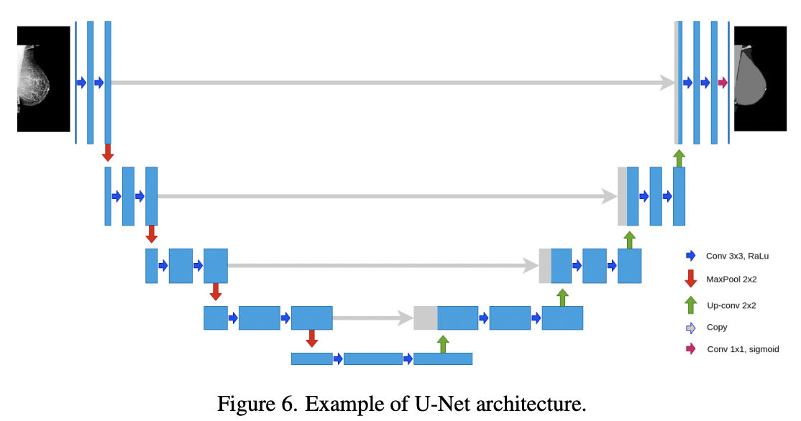
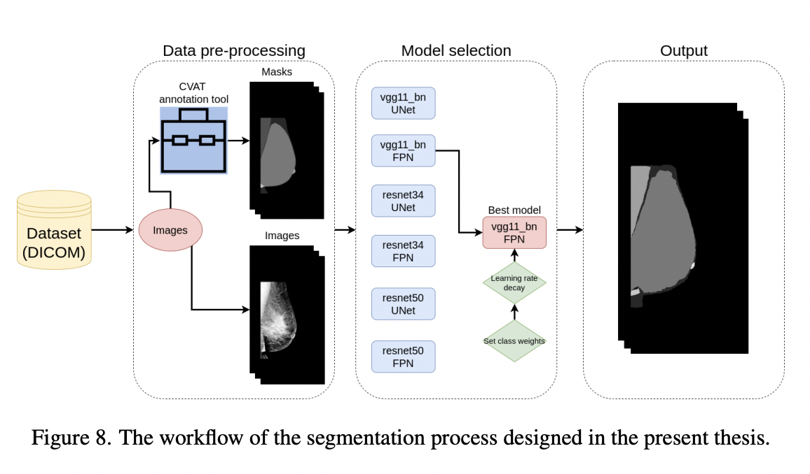
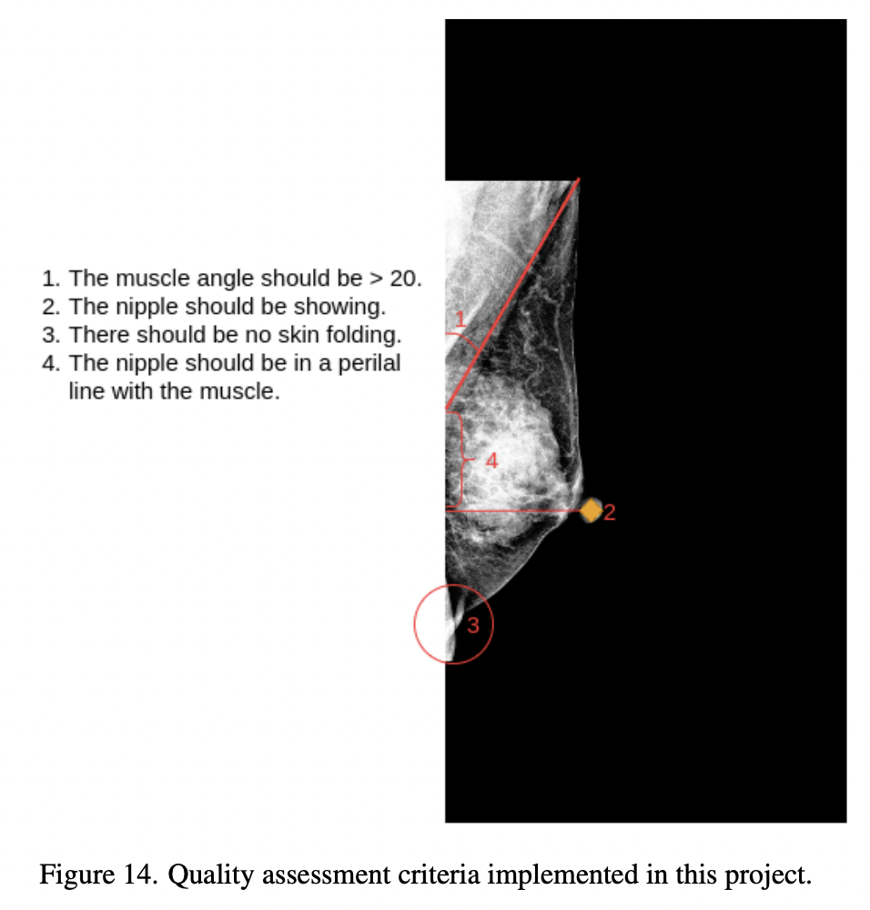
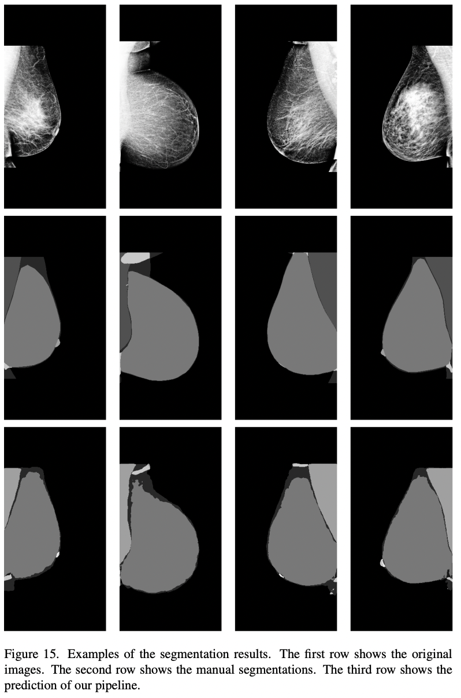
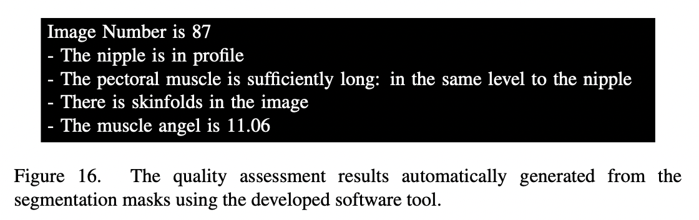

# DMQC
**DeepMammographyQualityControl** – a Python package for automatic quality assessment in mammography using deep learning.


## 📄 Related Publication

For more details, see the full thesis:  
[Deep learning-based lower back pain classification and detection from T2-weighted magnetic resonance images](https://oulurepo.oulu.fi/bitstream/handle/10024/18084/nbnfioulu-202106178375.pdf?sequence=1&isAllowed=y)

## 📝 Project Overview

DMQC automates quality assessment in mammography by segmenting anatomical features and imaging artifacts using deep learning, followed by rule-based evaluation aligned with [PGMI criteria](https://radiopaedia.org/articles/pgmi-image-evaluation-system-of-mammography). This system was developed as part of a Bachelor's thesis at the University of Oulu.

## 🧠 Methods

DMQC applies a two-step approach: deep learning-based segmentation of mammograms, followed by a rule-based evaluation aligned with PGMI criteria.

- **Dataset**: 503 manually annotated mediolateral oblique (MLO) view mammograms from Oulu University Hospital.

- **Annotations**: Images were labeled in CVAT with five pixel-level classes: whole breast, breast, pectoral muscle, nipple, and skin-folds.

- **Architecture**: U-Net and Feature Pyramid Network (FPN) decoders were tested with VGG11, ResNet34, and ResNet50 backbones. The U-Net architecture consists of an encoder-decoder path with skip connections to enable precise localization.  
    
  *Figure 6. U-Net architecture used for segmenting breast anatomy and artifacts.*

- **Workflow**: The system preprocesses input images, applies deep learning segmentation, and then evaluates the segmented masks based on diagnostic quality rules.  
    
  *Figure 8. End-to-end workflow: segmentation followed by PGMI-based quality control.*

- **Training**:
  - Input size: 512×256 (resized and zero-padded to preserve aspect ratio)
  - Augmentations: horizontal flips and cropping
  - Loss: multi-class cross-entropy
  - Evaluation metric: Dice coefficient (per class)

- **Quality Assessment**: After segmentation, a custom rule-based script evaluates four key positioning criteria from the predicted masks, including presence of the nipple, detection of skin-folds, muscle angle, and muscle length.  
    
  *Figure 14. Quality assessment criteria implemented using the PGMI standard.*

---

## 📊 Results

- **Segmentation Results**: The best-performing model (FPN with VGG11 backbone) achieved Dice scores above 0.90 for whole breast, breast, and muscle classes, and over 0.63 for skin-folds and nipple.

    
  *Figure 15. Segmentation results: original image (top), manual annotation (middle), and model prediction (bottom).*

- **Automated Assessment Output**: The software interprets the segmentation results to generate quality control reports, flagging issues such as poor nipple positioning or inadequate muscle visualization.

    
  *Figure 16. Automated quality assessment report based on segmented anatomical features.* 

## ⚙️ Package Contents

- `dmqc/` – Core segmentation and quality assessment code
- `conf/` – YAML configs for model and rules
- `env.yaml` – Conda dependencies
- `setup.py` – Install script

## 🚀 Getting Started

```bash
# Create environment
conda env create -f env.yaml
conda activate dmqc


